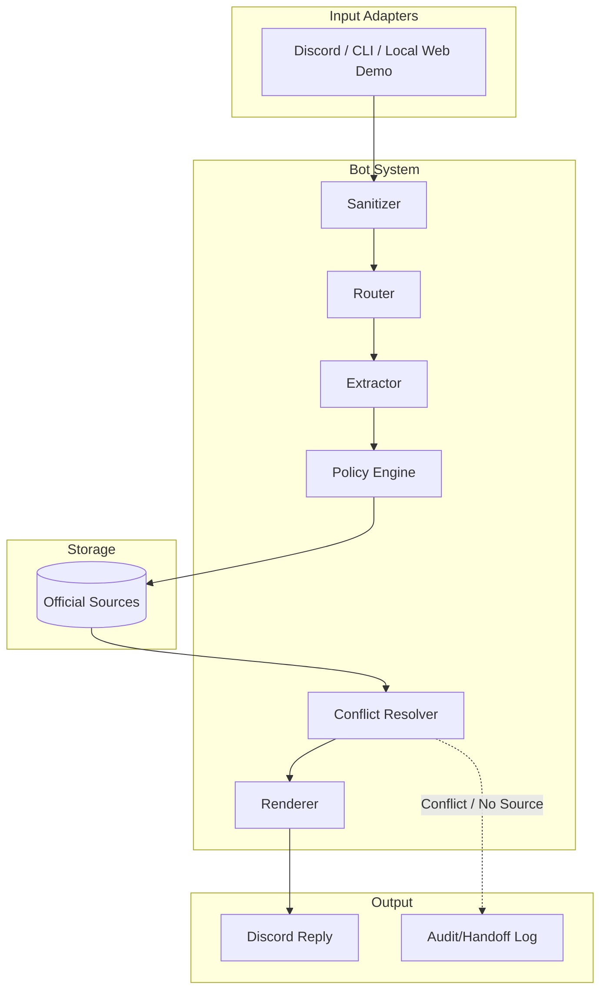

# Architecture Diagram

`discord-pack` là context index không có thẩm quyền: hệ thống chỉ dùng các
`msg_id` truy hồi được cho audit/handoff. Nó không đi vào `SourceRepository`
và không thể tạo ra `ANSWER_VERIFIED`; quyền này chỉ thuộc `OfficialSource`.

## Data Flow
1. **Input**: Message received from Discord.
2. **Sanitization**: Remove bad characters, format input.
3. **Router**: Determine if the query is a logistics question.
4. **Extractor**: Extract entities (e.g., date, topic).
5. **Policy Engine**: Evaluate against source policies (whitelisted sources only).
6. **Source Repository & Conflict Resolver**: Fetch facts. If conflicting facts arise, resolve deterministically (no pure timestamp reliance).
7. **Renderer**: Render message using strict templates.
8. **Output**: Send to Discord, or if no source / conflict exists, trigger handoff/audit.

## Trust Boundaries
- **Discord Input**: Untrusted.
- **Web/CLI Input**: Untrusted; the local web adapter limits request size and
  returns generic errors instead of exception details.
- **Official Sources**: Trusted.
- **LLM**: Semi-trusted (future use for classification only, never for deadline content generation).

## Failure Behavior
- **Source file missing**: Error.
- **Schema invalid**: Reject.
- **Production whitelist missing/mismatch**: Reject the source store at load time.
- **No source found**: Handoff to human TA.
- **Conflict in sources**: Handoff to human TA.
